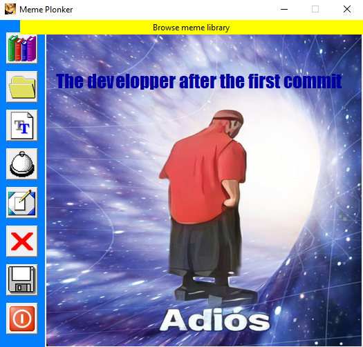
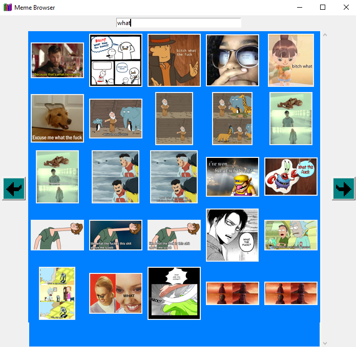

# Meme Plonker

Meme Plonker is a small meme editor with a deliberately retro **Windows 98** look, built with Tkinter. Add images and text to a canvas, move / resize / rotate them, recolor text, browse a tag-searchable meme library, and export the result as a transparent-aware PNG.

## Features




- **Browse meme library** — a scraped library of ready-made templates, searchable by **title *and* tags** (not just filename). Animated GIFs play in the browser grid.
- **Add image** — from the library, a file, or the clipboard (`Ctrl+V`, bitmap or copied files). Images are auto-resized (keeping ratio) to at most **half the screen**. **Animated GIFs play** on the canvas.
- **Add text** — with a **color picker** built into the text dialog (default black). Double-click text to edit it and its color.
- **Move / resize / rotate** — drag objects, use the corner handles to resize and the top handle to rotate. Arrow keys nudge the selection by 1px.
- **Bring to front** — raise the selected object above the others.
- **Auto crop** — shrink the working area to hug the content.
- **Delete** — remove the selected object (button or `Delete` key).
- **Save** — export to PNG; text is composited with a **transparent background** (no white box around the letters). If the canvas contains an animated GIF, it exports an **animated GIF** (text/images baked over every frame).
- **Retro touches** — beveled toolbar, classic tooltips, hover cursors, and click / crop / trash / save sound effects.

### Handy shortcuts

| Action | Shortcut |
| --- | --- |
| Copy the meme to the clipboard | `Ctrl+C` |
| Paste image from clipboard | `Ctrl+V` |
| Nudge selection (1px) | Arrow keys |
| Delete selection | `Delete` |
| Edit text & color | Double-click the text |
| Deselect | Click empty canvas |

> Copy (`Ctrl+C`) and Save produce an **animated GIF** when the canvas contains one, otherwise a still image. On the clipboard a static frame is always included as a fallback, since not every app pastes animated GIFs. On Linux, clipboard copy needs **`xclip`** (X11) or **`wl-copy`** (Wayland) installed.

## Installation

### Requirements

- Python 3.10+ (uses `match` statements and `X | Y` type syntax)
- [uv](https://docs.astral.sh/uv/) for dependency management
- The **Impact** font installed on your OS (used for meme text)

> **Forcing the text font.** By default the app uses the system **Impact** font, so if it isn't installed (common on Debian, where the preview then falls back to another font) the preview and the saved image can differ. Two options:
> - Install the font system-wide — on Debian: `sudo apt install ttf-mscorefonts-installer`.
> - Or drop a TrueType file at **`src/impact.ttf`**. It is registered at startup (Windows and Linux, via fontconfig) and used for both the preview and the export, and it gets embedded in builds. On Linux the first launch copies it into `~/.local/share/fonts`, so you may need to relaunch once.

### Run from source (recommended)

```sh
cd MemePlonker
uv sync          # creates the virtualenv and installs dependencies + the project
uv run plonker   # launch the app
```

`uv sync` installs the project in editable mode, so the `plonker` command works from **any directory**.

> **Note:** the project depends on `pygame-ce` (a drop-in fork of `pygame`) because it ships wheels for recent Python versions, including 3.14. It is still imported as `pygame`.

### Install as a global command (optional)

To get a `plonker` command available from anywhere (not just the project folder):

```sh
uv tool install .
```

This bundles the icons and sounds (`src/`) into the tool, so it runs from any directory. The meme library (~200 MB of images) is **not** bundled — point the app at it with the `MEMEPLONKER_MEMES` environment variable:

```sh
# Windows (PowerShell, persistent for your user):
[Environment]::SetEnvironmentVariable("MEMEPLONKER_MEMES", "C:\path\to\MemePlonker\meme_scrapper\output", "User")

# Linux / macOS (add to your shell profile):
export MEMEPLONKER_MEMES="/path/to/MemePlonker/meme_scrapper/output"
```

Open a new terminal afterwards so the variable is picked up. Without it the app still runs, but the meme browser shows no memes. After changing the code, refresh the tool with `uv tool install . --force`.

### Environment variables

| Variable | Purpose |
| --- | --- |
| `MEMEPLONKER_MEMES` | Path to the meme library (`meme_scrapper/output`). Needed for the global tool install; the app runs without it but shows no memes. |
| `MEMEPLONKER_DEBUG` | Set to `1`/`true`/`yes`/`on` for verbose debug logging. Off by default (only INFO and above are logged). |

### Development

```sh
uv run ruff check .      # lint
uv run ruff check . --fix # auto-fix
uv run ruff format .      # format
```

### Build a standalone executable (optional)

[PyInstaller](https://pyinstaller.org/) packages the app into a single native executable. **Build on the OS you want to target** — building on Windows produces `plonker.exe`, building on Debian/Linux produces a `plonker` binary (there is no cross-compiling). The command bundles the icons and sounds (`src/`) *inside* the executable; the meme library stays external because of its size.

> **Required on Debian/Linux — install Tk before building.** PyInstaller can only bundle Tkinter if the Python you build with can `import tkinter`; otherwise the built app launches and immediately dies with `No module named tkinter`. Tk is a separate OS package there:
>
> ```sh
> sudo apt install python3-tk
> ```
>
> Then confirm the interpreter you build with actually sees it before running PyInstaller:
>
> ```sh
> uv run python -c "import tkinter; print('tk', tkinter.TkVersion)"
> ```
>
> (macOS: `brew install python-tk`. Windows bundles Tk already, so no extra step.) If the check fails under `uv run`, your uv-managed Python was built without Tk — build with the system `python3` instead, or install a uv Python that includes it.

**Windows** (note the `;` in `--add-data`):

```sh
uv run --with pyinstaller pyinstaller --onefile --windowed --name plonker --icon src/icon.png --add-data "src;meme_plonker/src" meme_plonker/main.py
```

**Debian / Linux** (note the `:` in `--add-data`):

```sh
uv run --with pyinstaller pyinstaller --onefile --windowed --name plonker --add-data "src:meme_plonker/src" meme_plonker/main.py
```

The result is written to `dist/` (`dist/plonker.exe` on Windows, `dist/plonker` on Linux). Make the Linux binary executable with `chmod +x dist/plonker` if needed.

**Give it the meme library.** The library (~200 MB) is not embedded, so either:

- put the `meme_scrapper/output` folder next to the executable, or
- set the `MEMEPLONKER_MEMES` environment variable to its path (see [Environment variables](#environment-variables)).

Without it the app still runs, but the meme browser is empty. The **Impact** font must also be installed on the machine running the executable.

#### Embed the meme library (fully self-contained)

To ship the whole meme library *inside* the build so nothing external is needed, add it with a second `--add-data` and use `--onedir` (a one-folder build). One-folder avoids the slow per-launch extraction that a `--onefile` build of a ~200 MB library would incur.

**Windows:**

```sh
uv run --with pyinstaller pyinstaller --onedir --windowed --name plonker --icon src/icon.png --add-data "src;meme_plonker/src" --add-data "meme_scrapper/output;meme_plonker/meme_scrapper/output" meme_plonker/main.py
```

**Debian / Linux** (swap the `;` for `:` in both `--add-data`):

```sh
uv run --with pyinstaller pyinstaller --onedir --windowed --name plonker --add-data "src:meme_plonker/src" --add-data "meme_scrapper/output:meme_plonker/meme_scrapper/output" meme_plonker/main.py
```

This produces a self-contained `dist/plonker/` folder (~285 MB) — distribute (or zip) the whole folder and run `plonker` inside it. The embedded library is used automatically; `MEMEPLONKER_MEMES` still overrides it if set.

## Usage

- Launch with `uv run plonker` (or the built executable).
- Use the left toolbar to browse memes, add images/text, bring to front, crop, delete, save, or exit.
- Edit on the main canvas: drag to move, use the red corner handles to resize, the green top handle to rotate.
- Save your creation with the **Save** button.

## Project layout

```
meme_plonker/          # application code
meme_scrapper/output/  # meme library: images/ + memes.json (title + tags index)
src/                   # icons and sound effects
templates/             # README screenshots
```

## License

This project is licensed under the MIT License - see the [LICENSE](LICENSE) file for details.

---
